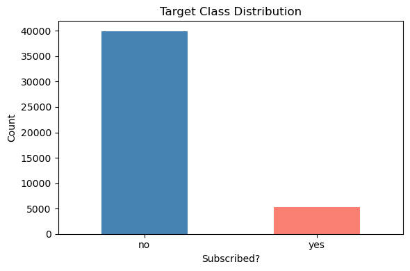
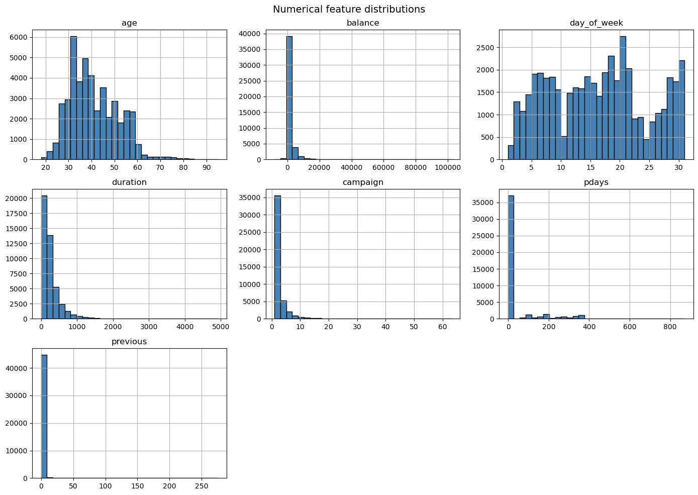
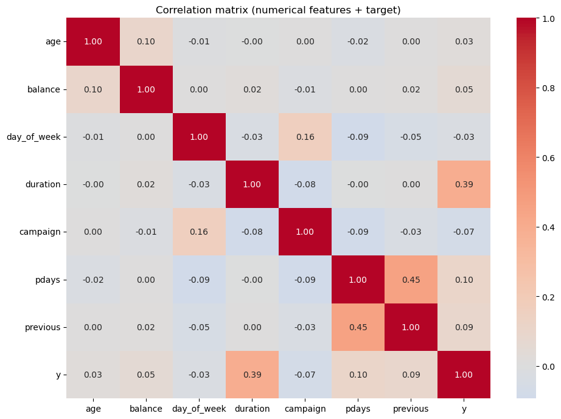
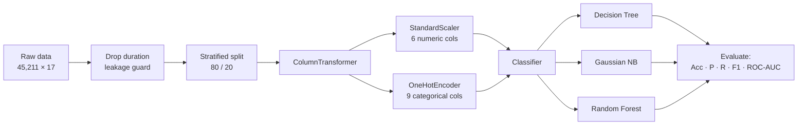
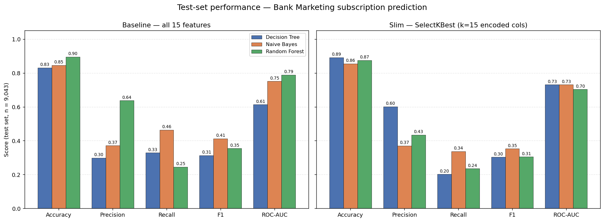
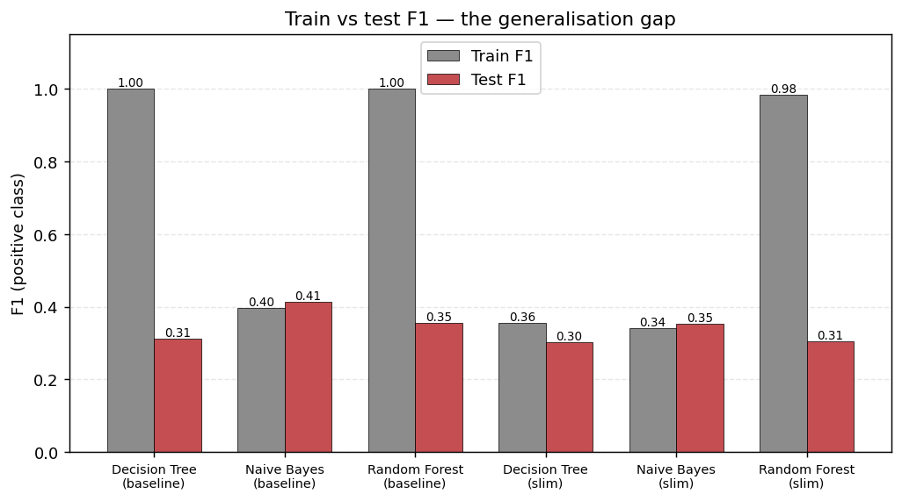
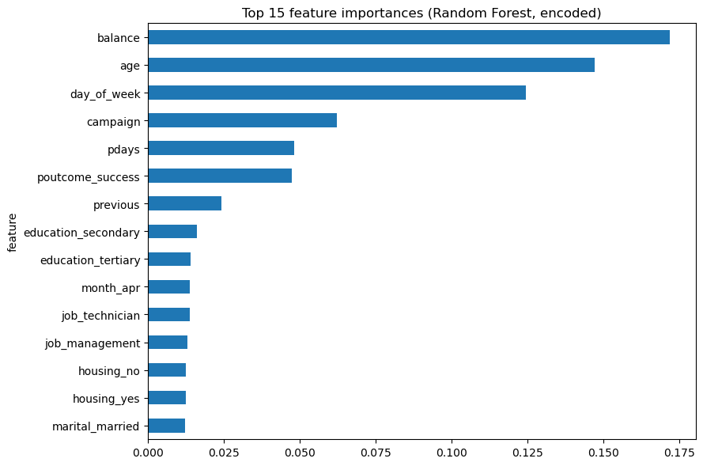

# Bank Marketing: Term Deposit Subscription Prediction

Assignment 1 · Supervised classification on the [UCI Bank Marketing dataset](https://archive.ics.uci.edu/dataset/222/bank+marketing) (ID 222).

The task: given what a Portuguese bank knows about a client *before* it calls them, predict whether that client will subscribe to a term deposit. Three classifiers are compared Decision Tree, Gaussian Naive Bayes, and Random Forest first on the full feature set, then on a reduced one.

---

## Table of contents

- [Dataset](#dataset)
- [Exploratory analysis](#exploratory-analysis)
- [Preprocessing decisions](#preprocessing-decisions)
- [Pipeline](#pipeline)
- [Results](#results)
- [Feature importance](#feature-importance)
- [Feature selection experiment](#feature-selection-experiment)
- [What the numbers actually say](#what-the-numbers-actually-say)
- [Limitations and next steps](#limitations-and-next-steps)
- [Running it](#running-it)

---

## Dataset

| Property | Value |
|---|---|
| Rows | 45,211 |
| Raw columns | 17 (16 features + target) |
| Features used | 15 (`duration` dropped) |
| Numeric | `age`, `balance`, `day_of_week`, `campaign`, `pdays`, `previous` |
| Categorical | `job`, `marital`, `education`, `default`, `housing`, `loan`, `contact`, `month`, `poutcome` |
| Target | `y` — did the client subscribe? |

**Class balance:** 39,922 "no" vs 5,289 "yes" **11.70 % positives**. This single number drives every modelling decision below.

Missing values (the UCI `unknown` levels arrive as `NaN` via `ucimlrepo`):

| Column | Missing | Share |
|---|---:|---:|
| `poutcome` | 36,959 | 81.7 % |
| `contact` | 13,020 | 28.8 % |
| `education` | 1,857 | 4.1 % |
| `job` | 288 | 0.6 % |

All other columns are complete. No numeric column has gaps.

---

## Exploratory analysis

### Target distribution



The imbalance is severe enough that a model predicting "no" for every single client scores **88.3 % accuracy** while being completely useless. That baseline is the number every result below has to beat in a meaningful way which is why accuracy is reported but never used as the deciding metric.

### Numeric feature distributions



Three things stand out:

- **`balance`** is extremely right-skewed with negative values (overdrafts) in the left tail.
- **`pdays`** uses `-1` as a sentinel for "never previously contacted" which describes ~82 % of rows, matching the `poutcome` missingness exactly. It is not a true continuous variable.
- **`campaign`** and **`previous`** are count variables with long thin tails; most clients were contacted a handful of times.

`age` and `day_of_week` are the only roughly well-behaved distributions, which is part of why `StandardScaler` was chosen over `MinMaxScaler` — min-max would compress the bulk of `balance` into a sliver of the [0,1] range because of a few outliers.

### Correlation matrix



Correlations between numeric features are near zero across the board — no multicollinearity to remove. Correlations with the target are also weak, which is an early signal that **no single numeric variable carries the answer**; the signal has to come from interactions and from the categorical block.

### Categorical cardinality

Checked before encoding, to know how wide one-hot would make the matrix:

| Feature | Levels | Largest level |
|---|---:|---|
| `job` | 11 | blue-collar (9,732) |
| `month` | 12 | may (13,766) |
| `marital` | 3 | married (27,214) |
| `education` | 3 | secondary (23,202) |
| `poutcome` | 3 | failure (4,901) |
| `default`, `housing`, `loan`, `contact` | 2 each | — |

Total cardinality is low, so one-hot encoding stays manageable and no target/frequency encoding is needed.

---

## Preprocessing decisions

Each of these was a deliberate choice, not a default:

**1. Drop `duration`.**
Call duration is only known *after* the call ends, and a call that ends in a subscription is mechanically longer. Keeping it leaks the target and inflates every metric. The UCI documentation explicitly warns about this. Dropping it is what makes the problem realistic and it is why the scores here look modest compared to results you'll see elsewhere on this dataset.

**2. Encode the target as 0/1.** `yes → 1`, `no → 0`, so precision/recall/F1 are defined on the minority class of interest.

**3. One-hot encoding, not label encoding.**
Label encoding would assign `blue-collar = 0, management = 4, technician = 9` and every distance-based or linear step would then read that as an ordering. There is no ordering. `handle_unknown='ignore'` guards against categories that appear in test but not train.

**4. `StandardScaler`, not `MinMaxScaler`.**
Standardisation centres each feature at zero with unit variance, which suits Gaussian Naive Bayes' distributional assumption. Min-max would squash the informative middle of the skewed features because of a handful of extreme values.

**5. Everything inside a `Pipeline`.**
This is the leakage guard. The scaler learns its mean and standard deviation, and the encoder learns its category set, from `X_train` only. At `predict` time the test set is *transformed* with those learned parameters, never re-fitted. Without this, cross-validation scores would be optimistically biased.

**6. Stratified 80/20 split.**
36,168 training rows / 9,043 test rows, with `stratify=y` holding the positive rate at 0.1170 in both halves. Confirmed in the notebook output.

---

## Pipeline



Evaluation uses a shared `evaluate_model()` helper that scores **both** train and test so the generalisation gap is visible, plus 5-fold `StratifiedKFold` cross-validation on the training set for stability.

---

## Results

### Baseline — all 15 features, default hyperparameters

| Model | Train Acc | Test Acc | Train F1 | Test F1 | Precision | Recall | ROC-AUC |
|---|---:|---:|---:|---:|---:|---:|---:|
| Decision Tree | 1.0000 | 0.8309 | 1.0000 | 0.3128 | 0.2982 | 0.3289 | 0.6132 |
| Gaussian Naive Bayes | 0.8408 | 0.8452 | 0.3968 | **0.4123** | 0.3708 | **0.4641** | 0.7514 |
| Random Forest | 1.0000 | **0.8954** | 0.9999 | 0.3547 | **0.6373** | 0.2457 | **0.7888** |

### 5-fold cross-validated F1 (training set)

| Model | Mean F1 | Std |
|---|---:|---:|
| Decision Tree | 0.3154 | ± 0.0185 |
| Gaussian Naive Bayes | **0.3925** | ± 0.0065 |
| Random Forest | 0.3265 | ± 0.0187 |

Cross-validation confirms the holdout ranking on F1 and shows Naive Bayes is also the **most stable** its standard deviation is roughly a third of the other two.

### Visual comparison



### The generalisation gap



This chart is the most important diagnostic in the project. Both tree-based baselines memorise the training set almost perfectly (train F1 of 1.00 and 0.9999) and then collapse on unseen data. An unconstrained Decision Tree grows until every leaf is pure that is textbook overfitting. Naive Bayes is the only model whose train and test scores agree, because it has almost no capacity to overfit in the first place.

---

## Feature importance



| Rank | Feature | Importance |
|---:|---|---:|
| 1 | `balance` | 0.1719 |
| 2 | `age` | 0.1471 |
| 3 | `day_of_week` | 0.1245 |
| 4 | `campaign` | 0.0623 |
| 5 | `pdays` | 0.0480 |
| 6 | `poutcome_success` | 0.0475 |
| 7 | `previous` | 0.0241 |
| 8 | `education_secondary` | 0.0160 |
| 9 | `education_tertiary` | 0.0140 |
| 10 | `month_apr` | 0.0138 |

Read this carefully, because impurity-based importance is biased. The top three are all high-cardinality continuous variables Gini importance systematically inflates features with many possible split points, so `balance` and `age` ranking first is partly an artefact of the metric, not proof they are the best predictors.

The genuinely interesting entry is **`poutcome_success` at rank 6**. It is a binary flag present in under 3.4 % of rows, yet it outranks every other encoded category. A client who said yes to a previous campaign is by far the strongest qualitative signal available which is a concrete, actionable finding for a marketing team.

---

## Feature selection experiment

Second run: `SelectKBest(mutual_info_classif, k=15)` on the encoded matrix, plus `max_depth=8` on the Decision Tree.

| Model | Train Acc | Test Acc | Train F1 | Test F1 | Precision | Recall | ROC-AUC |
|---|---:|---:|---:|---:|---:|---:|---:|
| Decision Tree (k=15) | 0.8997 | **0.8910** | 0.3551 | 0.3027 | **0.6011** | 0.2023 | **0.7307** |
| Gaussian NB (k=15) | 0.8533 | 0.8552 | 0.3407 | **0.3529** | 0.3699 | **0.3374** | 0.7306 |
| Random Forest (k=15) | 0.9962 | 0.8747 | 0.9836 | 0.3053 | 0.4346 | 0.2354 | 0.7034 |

**What changed:**

- **Decision Tree improved dramatically on the thing that mattered.** Depth capping cut the train F1 from 1.00 to 0.36 and lifted ROC-AUC from 0.613 to 0.731. Precision doubled (0.30 → 0.60). The tree stopped memorising and started generalising. Note this is the depth limit doing the work, not the feature selection.
- **Random Forest got worse** on every test metric. Discarding features starved the ensemble of the diversity it relies on random forests already do implicit feature selection at each split, so doing it again upfront is redundant and harmful.
- **Naive Bayes lost a little F1** (0.412 → 0.353) but kept its ROC-AUC.

The honest conclusion: feature selection was **not** a win here. Regularising the tree was.

---

## What the numbers actually say

**No model is production-ready, and that is the real finding.**

Every F1 sits between 0.30 and 0.41. Recall never exceeds 0.46, meaning the best model still misses more than half the clients who would have subscribed. With `duration` removed, the pre-call information in this dataset simply doesn't separate the classes cleanly.

**Which model to pick depends entirely on the business cost:**

| If the goal is… | Pick | Why |
|---|---|---|
| Don't waste agent time on bad leads | **Random Forest (baseline)** | Precision 0.637 — nearly two in three flagged clients actually convert |
| Don't miss potential customers | **Naive Bayes (baseline)** | Recall 0.464 — catches the most true positives |
| Rank leads rather than label them | **Random Forest (baseline)** | ROC-AUC 0.789 — best at ordering clients by likelihood |
| Explain the decision to a stakeholder | **Decision Tree (k=15, depth 8)** | Readable rules, and precision 0.601 is respectable |

**Accuracy is the trap.** Random Forest's 89.5 % looks strong until you compare it to the 88.3 % you'd get by predicting "no" every time. The entire model earns barely more than one point over doing nothing and the real value it adds is invisible in that metric. This is exactly why F1, recall, and ROC-AUC are reported.

---

## Limitations and next steps

Being explicit about what this assignment does *not* do:

1. **Class imbalance is never addressed.** No `class_weight='balanced'`, no SMOTE, no under-sampling. Every model defaults to the 0.5 decision threshold, which on 11.7 % positives pushes predictions heavily toward the majority class. This is the single biggest cause of the low recall.
2. **No threshold tuning.** ROC-AUC of 0.789 says Random Forest ranks clients well. Sweeping the decision threshold and picking the point that maximises F1 (or that meets a business constraint like "must catch 60 % of subscribers") would likely produce a much more usable model without retraining anything.
3. **No hyperparameter search.** `GridSearchCV` and `RandomizedSearchCV` are imported at the top of the notebook but never used. The `max_depth=8` in the slim run is a hand-picked value, and the fact that it helped so much suggests a proper search would help more.
4. **Missing values pass through unimputed.** `OneHotEncoder` silently treats `NaN` as its own category. For `poutcome` (81.7 % missing) this is arguably correct — "no previous campaign" is real information — but it should be an explicit `SimpleImputer(strategy='constant', fill_value='unknown')` rather than an implicit side effect.
5. **`pdays = -1` is fed to `StandardScaler` as a number.** The sentinel should be split into a binary `was_contacted_before` flag plus a properly-scaled `days_since` column for the 18 % where it applies.
6. **Eight markdown notes are written inside code cells.** Cell 13 raises a `SyntaxError` as a result. They should be converted to markdown cells so the notebook runs top-to-bottom cleanly.
7. **No confusion matrices are plotted**, despite `ConfusionMatrixDisplay` being imported — they would make the precision/recall trade-off far more legible than the numbers alone.

Fixing 1 and 2 alone would probably move test F1 from ~0.41 into the 0.50+ range.

---

## Running it

```bash
git clone <your-repo-url>
cd <repo>

pip install ucimlrepo numpy pandas matplotlib seaborn scikit-learn jupyter

jupyter notebook ASSIGNMENT_1_JAWAD.ipynb
```

Then run all cells. The dataset downloads automatically from the UCI repository via `fetch_ucirepo(id=222)` — no manual file handling.

> **Note:** cell 13 contains prose in a code cell and will raise a `SyntaxError`. Convert it to a markdown cell (`Esc` then `M`) before a clean run-all.

**Environment:** Python 3.12 · `RANDOM_STATE = 42` is set globally, so all splits, trees, and forests reproduce exactly.

### Repository layout

```
.
├── ASSIGNMENT_1_JAWAD.ipynb
├── README.md
└── images/
    ├── 01_target_distribution.png
    ├── 02_numeric_distributions.png
    ├── 03_correlation_matrix.png
    ├── 04_feature_importance.png
    ├── 05_model_comparison.png
    └── 06_overfitting_gap.png
```

---

## Reference

Moro, S., Rita, P., & Cortez, P. (2014). *Bank Marketing* [Dataset]. UCI Machine Learning Repository. https://doi.org/10.24432/C5K306
